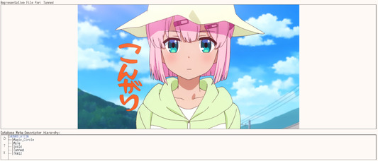

# Revision history for Tagger

------

# Unreleased

------

# Planned

## Front-end Changes
* Add some feedback when adding files to the database so the user knows then the process
is complete, optionally how many files were added.
* A Query builder element in the query widget section.
* Add option to rescan known folders.
* Bug Fixes
  * Ensure that shell processes spawned via GUI are non-blocking in the GUI

## Major Library Changes
* A macro system for storing queries and expanding them as text in a query.
  * Will be a library change, so will contribute to a major version.
* Multi-plex databases.
  * Connect to more than one database at a time.
  * Join tags and descriptors on virtual tables.
  * Dispatch new tagging queries to the appropriate database 
  with the appropriate descriptor.

------

# 2.0.0.0 -- 2023-03-18

## Breaking Changes:
- TaggerQL Syntax and Interpreter Implementation
  - TaggerQL was rebuilt from the ground-up as an expression-based query language.
    Its syntax is very similar in structure but there are some key differences:
    - Set Operations have been changed from "`U|, I|, and D|`" 
    to "`|, &, and !`" respectively.
    - All Set Operations are strongly left-associative.
    - Sub-expressions (the part of a query between "{" and "}"), now accept
    Set Operations!
  - Removed the syntactic token "`U.`" from the language.
    - Previously corresponded to a query that finds all untagged files in the database.
      This is a redundant token because that same set can be found trivially with a
      difference: "`p.% ! d.%`".
  - Deleted modules
    - Text.TaggerQL
    - Text.TaggerQL.Parser.Internal
    - Text.TaggerQL.AST
    - All members of the module hierarchy Text.TaggerQL.Engine
  - Replaced with,
    - Text.TaggerQL.Expression.Parser
    - Text.TaggerQL.Expression.AST
    - Text.TaggerQL.Expression.Engine
  - Renamed the sum type `QueryCriteria` from the `Data.Tagger` module 
  to `RingOperation` and moved it to Text.TaggerQL.Expression.AST.
- Database Changes
  - The database will be automatically patched and upgraded from version `1.0.2.1` to `2.0.0.0` when it is opened by Tagger.
  - Added new constraint conflict handlers to `Tag` and `MetaDescriptor` table.
  - Added many new triggers to encode some of Tagger's behavior into the table itself.
    This will make interacting with the database outside of Tagger's library
    much more safe, though this is still not, nor will ever be, a recommended use case.
  - Removed some database functions:
    - `deleteDescriptors'` and `updateDescriptors'`.
  - Replaced the database connection functions, `open` and `open'` with, respectively:
    - `openOrCreate`
      - Opens a file, or creates one if it does not exist, then attempts to read the version from the `TaggerDBInfo` table. If this table does not exist, then a database is initialized.
      - This is a potentially destructive function! Prefer using `open` whenever possible.
    - `open`
      - Attempts to open a database file. If the file does not exist or the `TaggerDBInfo` table does not exist, then exit with an error.
    - Both functions above will attempt to automatically patch the database if they determine it is out of date.
- Executable Changes
  - Removed the `taggercli` executable.
    - Its functionality has been merged with the normal executable, `tagger`
      - Added operations for adding files, tagging a file, removing files from the database, and deleting files from the database and file system.
- Library Changes
  - Types
    - Removed the `TaggedFile` type.
      - Consider using the `queryForFileTagsByFileId` query to achieve the same function.
  - Queries
    - Added
      - `queryForDescriptorByFileId`
        - Returns all `Descriptors` that are tagged to the given file. Most likely contains duplicates.
    - Removed
      - `getTagOccurrencesByFileKey`
        - It was only used in one place and I found I didn't care for it.
  - Removed the `OccurrenceHashMap` data type.
    - It can be easily replaced with a plain old `HashMap a Int`.
  - Renamed
    - Functions in the Text.TaggerQL.Engine module to be prefixed by yuiQL-

## Non-Breaking Changes
- Changed how tags ordered when using the --describe CLI command
  or when they are viewed in the image detail pane.
  - Tags are ordered in two groups:
    - Tags that have no subtags
    - Tags that do
  - In both of these groups, they are ordered alphabetically.
- Added a new text field when viewing the tag list of the selection.
It can be used to filter the tag list by MetaDescriptor patterns.
Intended to just be a more helpful way to view the current selection or as an aid
to querying.
- Changed the tag list to report only the number of files that have a given descriptor
applied. Not how many times the descriptor is applied.
  - I think both cases are valid but the intention behind the latter was less helpful
  and less intuitive than the former.
- Added some tooltips to the tag list filter and the shell command text field and button.
- Added some additional helper functions to `HierarchyMap` to make traversals
  a little bit less painful.
- An issue where spawned shell commands via the UI would block it from updating
or receiving any input.
- Changed the query input into a larger area, much like the tagging text field.
- Stopped updating a last_accessed field in the db on connection.
  - Consequently, write locks no longer happen when piping YuiTagger output back into
  a database a la 
  '`yuitagger data.db -q "p.%" --relative | xargs yuitagger data.db --describe`'
  making CLI operations more convenient.
- Added some visual feedback when files are being added to the database via the textfield.
- Add a new widget for selecting directories scan for new files.
  - Accessed via the "Directories" button next to the addFiles text field.
- When a query is run, the results are sorted alphabetically.
- Added a function yuiQLDeleteTagExpression which
  takes a tag expression and deletes the corresponding tags for a given list of files.
- Added a 'Options' pane below the tagging text field:
  - There is a toggle option to select many files to tag at a time.
  - There is an option to enter "Delete Mode" which allows a user to enter
  a tag expression into the textfield to delete tags from the current file, or selection
  of files.
- The text field for inserting descriptors can now accept a YuiQL expression which
  is used to define a descriptor tree. For example, `#ALL#{#META#{foo{bar}}}` will
  place the descriptor `bar` under `foo` which is placed under the `#META#` descriptor.
  - It is not necessary to qualify the absolute path to a descriptor, so the `#ALL#{#META#}`
  can be left out.
------

### 1.0.2.1 -- 2021-10-04

* Limited CLI functionality.
  Exposed through the `taggercli` program.
  * Querying
  * Report stats or audit results

------

### 1.0.2.0 -- 2022-09-19

* Enhanced the UI so that image is central and always fit to the full size of the page.
  * Other widgets are semi-transparent and float on top to the left or right side
  as resizeable panels.
  * Added new hotkeys for selectively hiding and showing each respective panel.
  * Furthermore, the layout of the widgets was changed and some extraneous widgets were
  removed altogether.
* Also changed the default SetOp in a query to be Intersect from Union.
  * This change could potentially break more complex queries, but it designed to make
  the query language more logically consistent. And it should have been the default from
  the beginning. See TN: 2edceb0e05

------

#### 1.0.1.1 -- 2022-08-21

* Fixed a bug: a50b7d8d4c81c844f22c502654b790e3895e7bb4
  * Relating to subquery accuracy. Specifically, queries of the format
    `r.a{b c} or any general type of criteria c for c.a{b c}` would return a superset of
    the intended results.
  * Giving a whole version to this fix because the presence
  of bugs in the query engine is quite vexing to me no matter how minor.

------

#### 1.0.1.1 -- 2022-07-23
* Reworked the complex term query engine to be more accurate.
Refer to Tech-note f02a13240b for some more information.

------

### 1.0.1.0 -- 2022-07-14
* Removed the "Last Saved" field in the info widget, because there is currenlty no
save functionality.
* Making the descriptor management pane more obvious and less intrusive by 
moving it to the bottom of the Unrelated descriptor tree widget and not hiding it 
behind a button.
* Improved spacing slightly in the tag list widget.
* Reduced visual weirdness of the buttons resizing when the file list is in view.
* Moved the addFileWidget and the edit button to the bottom of the file list in the scrollable
zone.

------

# 1.0.0.0 -- 2022-07-11

* I rewrote everything from scratch. Most functionality is the same.
Go to the wiki in the fossil repo to get up to speed on v1.0.0.0.

------

#### 0.3.4.1 -- 2022-06-13

* Changed VCS from git to fossil.

------

### 0.3.4.0 -- 2022-06-11

* Added some new command line options.
  * -h, --help, displays usage info.
  * -f, --database-file [path], sets a file to perform operations on. Possible operations are:
    * -r, --remove, removes the file from the database.
    * -m, --move [path], specify a path to move the given file to.
    * --delete deletes, a file from both the database and the system.
    It is recommended to remove a file then delete it, but deleting a file with this option
    should be completely safe.
  * -a, --add [path], a files at the given path to the database.
  * -p, --database-path [path], specifies the database for tagger to open.
  Specifying this option will temporarily override the database path given in tagger's config
  and any CLI options or operations done with tagger's GUI will use the database specified with this option.
* Changed the ShellCMD functionality to output ExitSuccess or other messages from completed commands to stderr instead of stdout.

------

### 0.3.3.0 -- 2022-05-24

* Introducing some command line arguments.
  * -v, --version, remains
  * -q, --query [query], will take a query string written in TaggerQL and return a list of file paths.

------

#### 0.3.2.3 -- 2022-05-17

* Changed the hotkeys used in the operation widget to apply globally,
not just when a widget in the operation widget is in focus. The hotkeys are described below.
* Added some sorting options to the tags "In Selection" in the image detail pane.
  * Can sort by tag alphabetically, or number of tags in the selection.
  * Ascending and Descending ordering.
* Adjusted ordering of DescriptorTrees so that Meta trees now sort by alphabetical value
of their descriptors instead of the length of their children lists.
* Fixed a bug where querying by untagged files would return 0 files if an empty query string was used.

| Hotkey       | Event                                                                                                                                |
|--------------|--------------------------------------------------------------------------------------------------------------------------------------|
| Ctrl-y       | Clears the file selection, with the selection buffer.                                                                                |
| Ctrl-u       | Runs the given shell cmd as specified in the `Cmd` textfield.                                                                        |
| Ctrl-i       | Previews the next image in the file selection. Consumes selection and adds to the buffer.                                            |
| Ctrl-k       | Previews the previous image in the file selection. Consumes the buffer and pushes it back to the selection.                          |
| Ctrl-j       | Changes the query's set arithmetic to the next value e.g. Union -> Intersect -> Diff                                                 |
| Ctrl-Shift-j | Changes the query's arithmetic to the previous value e.g. Union -> Diff -> Intersect                                                 |
| Ctrl-l       | Changes the query's query criteria to the next value e.g. Tag -> Pattern -> Relation -> Untagged                                     |
| Ctrl-Shift-l | Changes the query's query criteria to the previous value e.g. Tag -> Untagged -> Relation -> Pattern                                 |
| Ctrl-o       | Toggles between Tag and Untag mode                                                                                                   |
| Ctrl-Shift-o | Toggles between Tag and Untag mode but in the opposite direction :^)                                                                 |
| Ctrl-r       | Refreshes the application, searching for tag updates in the database, refreshing descriptor trees, and re-putting the image preview. |
| Ctrl-t       | Toggles `Solo Tagging Mode`                                                                                                          |

------

#### 0.3.2.2 -- 2022-05-16

* Added a connection string to the window that shows what database tagger is connected to
and if it has connected yet.
* Migrated Monomer to the official release of 1.4.1.0

------

#### 0.3.2.1 -- 2022-05-15

* Fixed a bug that would cause the lastBackup time string to get reset in the database whenever it's connected to.

------

### 0.3.2.0 -- 2022-05-14

##### Breaking Changes

* Changed some column names in Tag.
* Added a new TaggerDBInfo table for database-level version tracking.

To upgrade, run the script `Migrate0_3_1_0To0_3_2_0.sql` on a database that is up-to-date with tagger v0.3.1.0

#### Non-breaking changes:

* Implemented a new SDL query language to use in the Query textfield!
  * Normal queries as they have been previously written still work.
  * With the new language, you can fit many unions, intersections, and differences in to one query
  * You can also query by Descriptor, Relation, and Pattern in one query.

### Tagger Query Language:

Previously, file patterns, descriptor patterns, and descriptor relation trees could be queried all by text input
in the Query textfield. But if you wanted to search for a tag relationship then difference that by a file pattern query, you had to run two separate queries and interact with the GUI dropdowns to change set arithmetic. With the Tagger Query Language, you can now combine many queries into one.

The rules are simple: Tag search, Relation search, or Pattern search can now specified per-token by prepending a specific operator to the front of the token. For instance, if you wanted to search for files that contain the string "roughdraft" in them, you would normally select the Pattern option from the dropdown then query with the token "%roughdraft%". But with the Tagger Query Language, this can be written as "p.%roughdraft%" and tagger will search by file pattern, regardless of what the current dropdown selection is.

The tokens for these searches are: 
```
Tag      -> t.
Relation -> r.
Pattern  -> p.
```

Unions, intersections, and differences work similary. These tokens are placed inbetween query sections to describe how they are combined together.

The tokens for these operations are:
```
union      -> u|
intersect  -> i|
difference -> d|
```

Here are some examples.

I want to find all files that are tagged with 'Rough_Draft' and are in a folder called 'documents'
```
t.Rough_Draft i| p.%documents%
```

I want to find all files that are related to the tag 'Work' but not the files tagged with 'Side_Project'
```
r.Work d| t.Side_Project
```

I want to find find all images of Yui Otsuki that are subtagged with 'dress' or 'cute' that are not seasonal and do not have white backgrounds
```
t.otsuki_yui {dress r.cute} d| r.seasonal d| image_background{white}
```

From these examples, you can see that the search tokens are optional, if they are not specified, then Tagger uses whatever is selected in the relevant dropdown.

Some restrictions:
* You can not precede a subtag search with a pattern query.
  * `p.%filepattern% {something}` will fail to parse and output a parse error.
* You can not use pattern queries inside subtag searches.
  * `something {p.%filepattern%}`
* You can not do set arithmetic inside a subtag search, though this is planned as a future feature. By default, all results from individual subtags are unioned together.
  * `something {this d| that}` fails to parse and prints a parse error.

------

### 0.3.1.0 -- 2022-05-12

* Migrated to Monomer 1.4.0.0-dc848e8ddb76ba6d8339b47f8bc3a0ff3982950c.
* Introduced a new config option, `style.window.window_scaling_factor`.
  * A double value that controls the relative size of text and widgets in the window.
    * Values will most likely be in-between 1.0 and 2.0.
* Introduced an optional config option `style.window.window_icon`.
  * Takes a path to .bmp images and uses it as the window icon.
##### Minor Changes
* Added a dispose event to close the database connection.

------

## 0.3.0.0 -- 2022-05-10

* Introduced Subtagging!
  * Using the image featured in 0.2.0.0, I will demonstrate how subtags may be used.
  * Subtags are added to an image using curly brackets in the Tag textfield. For instance,
  I want to tag the character Momo Chiyoda in the above image but I want to also tag the image with
  descriptors that may only apply to her specifically. For that I will use subtags.
  ```
  Chiyoda_Momo{tanned}
  ```
  With this, we can see that the tanned keyword is only applied to the Chiyoda_Momo tag.
* Queries using Subtags.
  * Querying with subtags can be done normally, as in any file with a queried tag will be part of the new selection.
  * Querying using subtag notation will fetch a selection that contains only files that have that specific sub-tagging combination.
    * If I search `tanned` I will get all images with tanned characters. However, if I search `Chiyoda_Momo{tanned}`
    I will get only the images with that specific combination.
* Draggable tag association.
  * In the Image details pane, for tags on a single image only, each tag is draggable.
    * A new zone has been designated `untag` for these tags. When a tag is drag-and-dropped into that zone,
      that specific tag will be deleted.
      * Untagging can still be done via the Tag text field but is less precise and may end up deleting more than you wanted to.
  * New subtags can be made from existing tags by dragging one tag on top of another, this will place the dragged tag as a 
  sub tag of the target.
* Breaking changes:
  * Any databases created on versions 2.x or lower need to run the Migrate0_2_XTo0_3_X.sql
  script. Any desired subtags will have to be created manually.

------

#### 0.2.0.1 -- 2022-05-02

 * Fixed a bug with unioning results into a BufferList. Should hopefully no longer union duplicate files into the selection BufferList.

------

## 0.2.0.0 -- 2022-05-01


* Added a new Representative File feature:
  * Added a new table `Representative`
    * This table creates links between a descriptor and an image. The purpose of creating
    Representative links is to provide a quintessential example of what a descriptor is meant
    to convey when it tags a file. It is meant to be used as an aid for tagging, rather than querying.
    Shell commands cannot be performed on a Representative file that is being previewed, nor can it be tagged.
  * Representative files are viewed in the `Descriptor` config page.
    * From the Descriptor tree structure of the database, drag a descriptor into the Representative box.
    If there is a representative file for a given Descriptor it will be displayed, otherwise nothing will happen.
  * To create a Representative file, in the main page of the application, drag an image or filename from either the active image preview or the image selection buffer.
    Then drop it onto the descriptor, in the Main descriptor widget on the bottom left, that you want to create a representative link for.
    A box will appear around a given descriptor as you drag a file over it to show you which descriptor a link will be created for.
* Minor fixes involving the lazy selection buffer. When unioning, intersecting, or diffing a new query.
The buffer will not flush but rather be unioned, intersected, or diffed appropriately with the contents of the new query selection.
* Added new fields to the config file: `style`, `style.font`, and `style.window`.
  * `style.font` takes three keys, `regular`, `thin`, and `bold`. These are paths to a font for tagger to use.
  * `style.window` takes three keys. `maximize`, `window_size_x`, and `window_size_y`.
    * `maximize` is a boolean, if true the window is maximized on start-up.
    The other two keys are the x and y sizes to use for the window if false.
* Moved the `Shell Command` used on startup to the config file under the key `shell_command`.
  * Exporting the config will now export the current shell command as well.

------

#### 0.1.4.1 -- 2022-04-30

* Fixed a bug with the lazy selection that would flush the buffer when an image was tagged.
* Fixed a bug where shuffling an empty selection would result in an infinite hang.

------

### 0.1.4.0 -- 2022-04-30

* Added the FileSelection widget back in.
  * It uses a lazy buffer that can be loaded or flushed for a more responsive GUI.
  * Uses a new config field ```selection.buffer_size = int``` to determine how many elements to load.
  * Added buttons to load, load all, flush, and shuffle the file selection.
* Improved styling of the ImagePreview widget.
  * Added a filename to the top left.
  * Made it a drop target for FileWithTags.
    * Dropping a file from the fileSelection Widget into the image preview widget will open a preview of that file.
      * Does not change the order in which images are cycled via Ctrl-i or -k.
  * Made it a draggable FileWithTags.
    * There aren't currently any other widgets that are drop targets for this message type.

------

### 0.1.3.0 -- 2022-04-27

* Added a field to rename descriptors.
  * In the Descriptor configuration page.

------

#### 0.1.2.1 -- 2022-04-27

* Added a command line option `-v, --version` to see the program version.

------

### 0.1.2.0 -- 2022-04-26

* Adjusted the Cmd so that, if Solo Tagging Mode is enabled, the shell cmd
  will take the file currently previewed as the command's only argument.
  If Solo Tagging Mode is not enabled or there is no file previewed then all files in the
  selection are arguments to the shell cmd.
  * The argument substitution keyword is still '`%file`'

------

### 0.1.1.0 -- 2022-04-25

* Added a new configuration table and field: 
  * [descriptor_tree]
    * main_request
      * A text field with the name of a descriptor for the main descriptor tree widget 
      to request when the refresh button is pushed.
* Also added a 'Descriptor' configuration page.
  * Can change the value of descriptor_tree.main_request there.
  * Can also view a similar version of the main descriptor tree widget there.
* Stopped the descriptors in the #UNRELATED# tree widget from sending request events
to the main tree widget when clicked.

------

## 0.1.0.0 -- 2022-04-23

* First version. Released on an unsuspecting world.
